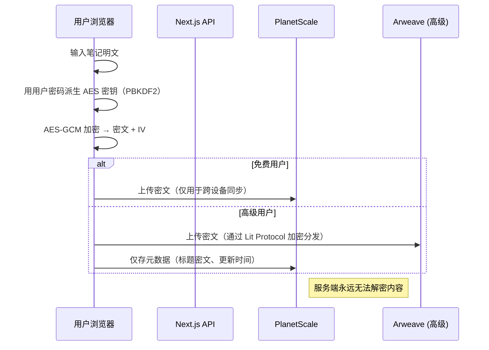
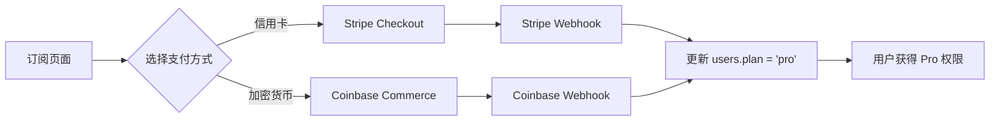

# 📝 Sovereign Notes

## Web3 隐私优先的个人笔记与待办清单工具

**MVP 技术与产品文档 v1.0**\
*最后更新：2026 年 1 月 15 日*

***

## 一、产品定位

> **“你的笔记，永远属于你——端到端加密、跨设备同步、支持钱包登录，无广告、无追踪。”**

*   **目标用户**：注重隐私的个人用户、Web3 爱好者、远程工作者
*   **核心价值**：
    *   ✅ 真正端到端加密（E2EE），服务端无法读取内容
    *   ✅ 支持传统登录（邮箱/Passkey） + Web3 钱包登录
    *   ✅ 免费基础版 + 透明高级订阅（\$5/月）
    *   ✅ 支持法币（Stripe）与加密货币（USDC/ETH）双轨支付
*   **非目标**：团队协作、富媒体编辑、AI 生成（MVP 阶段）

***

## 二、核心功能（MVP）

| 功能                 | 免费版            | 高级版（\$5/月）                        |
| ------------------ | -------------- | --------------------------------- |
| 本地加密笔记 & 待办        | ✅              | ✅                                 |
| Markdown 编辑 + 代码高亮 | ✅              | ✅                                 |
| 跨设备同步              | ❌              | ✅（加密后存去中心化网络）                     |
| 存储空间               | 仅本地（IndexedDB） | 2 GB（Arweave + Lit Protocol）      |
| 自动备份快照             | ❌              | ✅（每日加密快照）                         |
| 登录方式               | 邮箱 / Passkey   | + 钱包登录（MetaMask 等）                |
| 支付方式               | —              | Stripe（信用卡） / Coinbase（USDC, ETH） |

> 💡 所有加密操作在浏览器完成，密钥永不离开设备。

***

## 三、技术栈

### 🧱 全栈框架

| 类别  | 技术                               | 版本        | 说明                                   |
| --- | -------------------------------- | --------- | ------------------------------------ |
| 运行时 | Node.js                          | `20+`     | -                                    |
| 框架  | Next.js                          | `14.2.15` | App Router + React Server Components |
| 语言  | TypeScript                       | `5.5+`    | 全栈类型安全                               |
| 构建  | Turbopack (dev) / Webpack (prod) | -         | 内置                                   |
| 包管理 | pnpm                             | `9.x`     | 快速、节省磁盘                              |

### 🎨 前端 UI

| 组件                                | 用途                    |
| --------------------------------- | --------------------- |
| `shadcn/ui` + Radix UI            | 可定制、无障碍、暗色模式友好        |
| Tailwind CSS `3.4.3`              | 原子化样式                 |
| Lucide React `0.450.0`            | 图标                    |
| `react-markdown` + `rehype-shiki` | 安全 Markdown 渲染 + 代码高亮 |

### 🔐 认证与权限

| 技术                    | 作用                                     |
| --------------------- | -------------------------------------- |
| `@clerk/nextjs 5.0.0` | 用户认证（邮箱/Google/Passkey）                |
| 自定义 Web3 桥接层          | 集成 Web3Auth，将钱包地址映射为 Clerk External ID |
| Middleware            | 拦截未授权访问 `/app/*` 路由                    |

### 🗄️ 数据库与存储

| 层级             | 技术                     | 说明                 |
| -------------- | ---------------------- | ------------------ |
| **结构化数据**      | PlanetScale (MySQL)    | 存用户元数据、笔记密文、订阅状态   |
| **ORM**        | Drizzle ORM `0.30.0`   | 轻量、类型安全、支持 migrate |
| **去中心化存储（高级）** | Arweave + Lit Protocol | 加密笔记持久化，权限由用户钱包控制  |
| **本地存储**       | IndexedDB              | 免费用户数据缓存           |

### 💳 支付系统

| 方式   | 服务商                         | 说明                              |
| ---- | --------------------------- | ------------------------------- |
| 法币订阅 | Stripe                      | 主支付通道，支持 Apple Pay / Google Pay |
| 加密货币 | Coinbase Commerce           | 支持 USDC、ETH，固定 USD 定价，1% 手续费    |
| 订阅状态 | PlanetScale `users.plan` 字段 | `free` / `pro`，由任一支付成功触发更新      |

***

## 四、隐私与安全模型

### 🔒 数据流（关键！）

### ✅ 安全承诺

*   所有加密使用 **Web Crypto API**（浏览器原生，不可篡改）
*   密钥**不上传、不存储**于任何服务器
*   支持用户**导出完整加密数据包**（`.sovereign.enc`）
*   无 IP 日志、无行为追踪、无第三方分析（除必要支付外）

***

## 五、Web3 融合设计

| 功能           | 实现方式                                                        |
| ------------ | ----------------------------------------------------------- |
| **钱包登录**     | Web3Auth 前端 SDK → 签名验证 → 创建/关联 Clerk 用户（External ID = 钱包地址） |
| **ENS 显示**   | 前端调用 ENS 合约，将 `0x...` 显示为 `alice.eth`                       |
| **链上凭证（未来）** | 持有特定 NFT 自动解锁 Pro（通过 Alchemy 监听）                            |
| **去中心化存储**   | 高级用户数据加密后存 Arweave，访问权限由 Lit Protocol 控制                    |

> ⚠️ Web3 是**增强选项**，非强制。普通用户可完全忽略。

***

## 六、支付集成策略

### 双轨支付流程

### 为什么保留 Stripe？

*   覆盖 70%+ 非 Web3 用户
*   转化率高（Apple Pay 一键支付）
*   提供信任背书
*   你已集成，边际成本≈0

***

## 七、开发路线图（个人开发者友好）

| 时间         | 里程碑                  | 关键产出                     |
| ---------- | -------------------- | ------------------------ |
| **Week 1** | 核心编辑器 + 本地加密         | 可离线使用的笔记/待办，纯前端          |
| **Week 2** | Clerk 集成 + CRUD      | 用户登录、笔记增删改查（密文存 DB）      |
| **Week 3** | Stripe 订阅 + 权限       | 免费/Pro 切换，Stripe webhook |
| **Week 4** | Coinbase Commerce 接入 | Crypto 支付按钮 + webhook 升级 |
| **Week 5** | Web3Auth 钱包登录        | 支持 MetaMask 登录并关联账户      |
| **Week 6** | MVP 上线 + PH 发布       | producthunt.com 发布，收集反馈  |

***

## 八、合规与运营

*   **隐私政策**：明确说明“我们无法访问你的笔记”
*   **支付合规**：Stripe + Coinbase 均负责 KYC/AML，你只需记录交易 ID
*   **退出机制**：提供“导出全部数据”功能（含解密说明）
*   **定价透明**：官网公示“`$5/月 = 存储成本 $`0.8 + 开发维护”

***

## 九、未来扩展方向

*   PWA 安装 → 桌面/手机 App（Electron / Capacitor）
*   插件系统（如 Notion-like blocks）
*   DAO 团队版（B2B 高 ARPU）
*   Token-gated 模板市场（创作者分润）

***

> **Sovereign Notes 不是另一个笔记工具，而是一个“数据主权”的入口。**\
> 我们不做 AI、不做社交、不做广告——只做一件事：**让你的数据，真正属于你。**

***

📄 **附录**

*   [ ] GitHub 仓库初始化模板（Next.js 14 + Clerk + Drizzle）
*   [ ] 加密工具类（`cryptoUtils.ts`）
*   [ ] Coinbase Webhook 验证中间件
*   [ ] PlanetScale 表结构（Drizzle schema）
